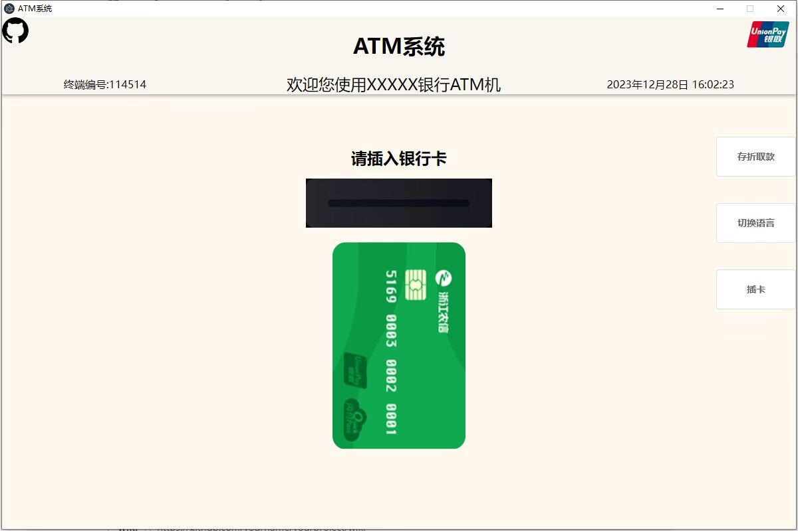

以下是源项目的README

# 软件工程实践——ATM系统
> 模拟现实ATM机交互基本功能

## 项目介绍

😋 本项目能实现人工柜台能够实现的大部分的功能，包括取款、打印凭条、存款、余额查询、明细查询、转账、修改密码、代理业务等。

😍 注意：本项目采用前后端分离，本仓库为前端部分，后端部分请查看本组织后端部分，可从下方**后端支持**跳转。

## 功能分析

1. 取款：插入银行卡后，用户能够通过ATM机输入取款金额取款。若银行卡余额小于要取款现金数，则不能取出；取款成功后弹出现金，修改用户的余额，并且在银联系统中写入操作。

2. 打印凭条：插入银行卡并进行相应的取款、消费操作后，能够打印出交易确认单。

3. 存款：插入银行卡后，用户将钞票放入ATM机中，ATM机要能够清点现金。修改客户银行卡余额，并将信息写入银行的银联系统中。

4. 余额查询：插入银行卡后，用户能够通过ATM机查询当前卡中的余额。

5. 明细查询：插入银行卡后，用户能够通过ATM机查询当前银行卡的流水明细。

6. 转账：插入银行卡后，用户能够通过ATM机给其他的银行账户转账。若银行卡余额不足则不能完成转账操作。转账成功后，应对用户和收账人的账户余额进行相应修改，并且将信息写入银行的银联系统。

7. 修改密码：插入银行卡后，用户可以通过验证旧密码来修改银行卡密码。修改成功后，将操作信息写入银联系统。

8. 退卡：完成操作后，点击屏幕上的退卡，可以将银行卡弹出。

## 使用

Windows:

```sh
安装依赖
npm install
运行项目
npm run dev
打包项目
npm run build
```

## 在线预览

 👀 [ATM系统](http://1.116.150.155:12322/#/)

## 样例



## 技术栈

- 开发框架：Vue3 + Electron
- 组件库：ElementPlus
- 预处理器：Sass  
- 打包工具：Vite
- 代码规范：Eslint + Prettier
- 状态管理：Pinia
- 路由跳转：Vue-Router
- 原子化CSS：UnoCSS
- 网络请求：Axios

## 后端支持

😅	[ZAK-ruangong/ATM-Springboot-: ATM后端 (github.com)](https://github.com/ZAK-ruangong/ATM-Springboot-)

## 历史版本

- 1.2.1
  - 修复若干Bug

* 1.2.0
    * 添加Electron打包桌面端
    * 上线Web端
* 1.1.0
    * 优化样式
    * 修复若干Bug
* 1.0.0
    * 分功能开发基本实现
    * 合并完成基本版本
* 0.2.0
    * 首页功能实现
    * 完成功能列表
* 0.1.0
    * 项目初始化及基本配置

## 贡献者

<table>  <tr style="display:flex;justify-content:space-between;">    
    <td align="center" style="flex:1;"><a href="https://github.com/SongHunangshang" ><br /><sub><b>😅&nbsp;</onghuangzhushangb></sub></a><br />
    <td align="center" style="flex:1;"><a href="https://github.com/xxqwq"><br /><sub><b>🤔&nbsp;xxqwq</b></sub></a><br />
    <td align="center" style="flex:1;"><a href="https://github.com/Licne"><br /><sub><b>😭&nbsp;Licne</b></sub></a><br /></tr></table>

